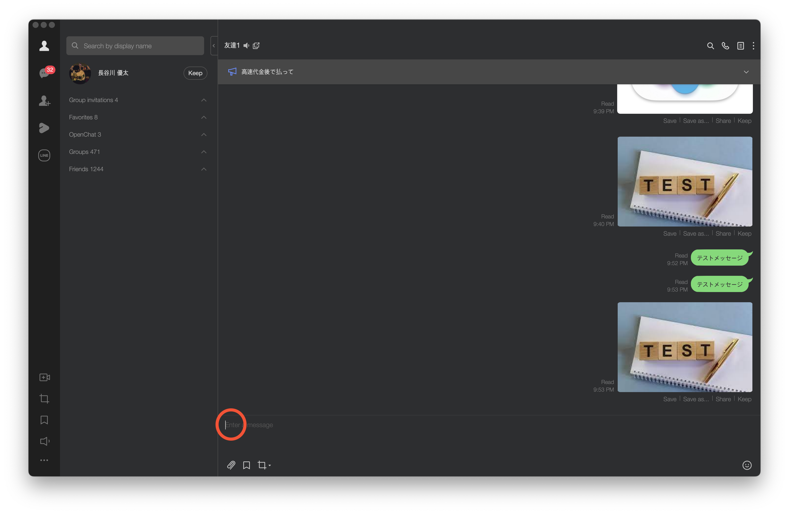
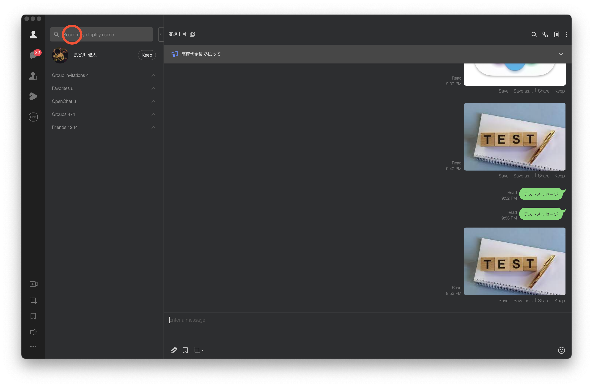

# LINE一斉送信の自動化スクリプト

## 動作環境
* MacOS
* Alfred 4.6.2
* Python 3.9.7
* LINE ver 7.7.0.2698
* pyperclip 1.8.2
* PyAutoGUI 0.9.54

## 環境構築

```
pip install -r requirements.txt
```

## 座標設定
以下の座標を`send_message_on_line.py`にて設定する

### message_coordinate


### friend_coordinate


### profile_coordinate


### search_coordinate


### select_coordinate


### chat_coordinate
※ まだチャットしたことのない友達の場合のみ出てくる画面


## 送信内容設定
送りたい人とそれぞれのメッセージをリスト形式で追加する。写真を送りたい場合には、写真の名前を設定する。

```
friend_list = [
        "友達の名前1",
        "友達の名前2"
]
```

```
message_list = [
        "テストメッセージ1",
        "テストメッセージ2"
]
```

```
image_list = [
        "photo_to_send.jpeg",
        "photo_to_send.jpeg"
]
```


